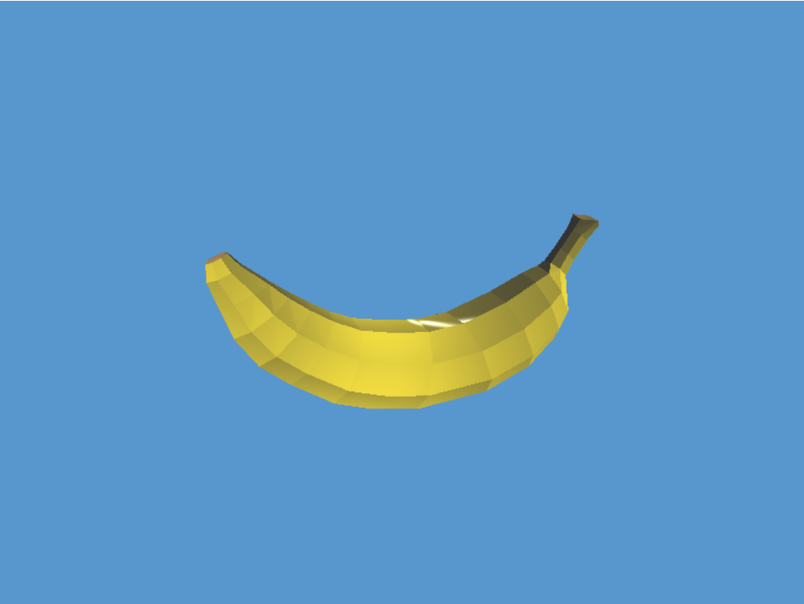

# 🍌 banana.js 🍌
Check out [projects](https://github.com/banana-js-engine/banana-js-examples) made with banana.js

## ⬇️ Installation
Download the npm package using: ```npm install -g @mfkucuk/banana-js``` <br />

## 🚀 Quick Start
```
create-bananajs-app <project_name>
cd <project_name>
npm start
```

This will create and start the template project, and will be greeted by this screen:


## 📝 Template
- `index.js` is the entry point of your project which renders the < $${\color{lightblue}GameApp}$$ > component.<br/>
- `GameApp.js` contains the component that represent your game. You will mainly work with this component to define the structure of your game.
- `public/` directory contains assets like a React project, also use it for storing game assets (texture, audio, model, material). This folder will be the root folder for locating these type of files.
- `script/` directory contains your banana-js scripts. These are special JavaScript files whose lifetimes are handled by the engine.

# Reference
## Components
### < Transform />
Defines the orientation of the GameObject in the scene.
```jsx
<GameObject>
    <Transform/> /* position=[0, 0, 0,] rotation=[0, 0, 0] scale=[1, 1, 1] */
</GameObject>
```
Alternatively, you can pass in props to change the default values:
```jsx
<GameObject>
    <Transform position={[2, 1, 0]} rotation={[0, 0, 30]} scale={[0.5, 2, 1]}/>
    <Sprite/>
</GameObject>
```

### < Sprite />
Defines the how the GameObject will be rendered.
```jsx
<GameObject>
    <Transform/>
    <Sprite/> /* Renders the default white square */
</GameObject>
```
You can change the color of the sprite using the color prop:
```jsx
<GameObject>
    <Transform/>
    <Sprite color={[1, 0, 0, 1]}/> /* Renders a red square */
</GameObject>
```
You can set a texture as well, (png, jpg, etc.) by giving a src path:
```jsx
<GameObject>
    <Transform/>
    <Sprite src="tree.png"/> /* Renders a sprite with a tree texture */
</GameObject>
```
### < OrthographicCamera /> 
Defines a orthographic view for the scene.

### < PerspectiveCamera />
Defines a perspective view for the scene.

### < Script />
Defines a custom behaviour on the GameObject.
```jsx
<GameObject>
    <Transform/>
    <Script import={import('./scripts/HelloWorldScript')}/>
</GameObject>
```
Scripts are special JavaScript files whose lifetimes are controlled by the framework. They must be dynamically imported as shown above. Scripts must have single classes in them which inherit the `ScriptComponent`.
Here is the `HelloWorldScript.js` imported above:
```javascript
import { ScriptComponent } from '@mfkucuk/banana-js';

export class HelloWorldScript extends ScriptComponent {

    ready() {
        console.log('Hello, world!');
    }
}
```
`ready` function will be called when the game first starts. Click [here](#scriptcomponent) to read more on `ScriptComponent`.

### < Audio />
Defines an audio that can be played.
```jsx
<GameObject>
    <Transform/>
    <Audio src="main-menu.mp3" playOnStart/>
</GameObject>
```
`playOnStart` makes it so that the audio starts playing when the game starts. You can also use this component programmatically in scripts:

```jsx
<GameObject>
    <Transform/>
    <Audio src="coin-pickup.wav" volume={0.4}/>
</GameObject>
```
```javascript
export class CoinScript extends ScriptComponent {

    ready() {
        this.coinAudio = this.getComponent(ComponentType.Audio);
    }

    onCollisionEnter2D(other) {
        this.coinAudio.playOnce();
    }
}
```

or,

```javascript
export class MusicScript extends ScriptComponent {

    ready() {
        this.music = this.getComponent(ComponentType.Audio);
        this.music.play();
    }

    onViewportEnter() {
        this.music.resume();
    }

    onViewportExit() {
        this.music.pause();
    }
}
```
Because of the restrictions of the AudioContext of browsers, once a audio is played, they should be controlled with `pause` and `resume` functions.

### < BoxBody2D />
Defines a box shaped physics object for physics interactions in the scene.

### < CircleBody2D />
Defines a circle shaped physics object for physics interactions in the scene.

### < Animator > </ Animator >
Defines a frame-by-frame animation for a GameObject, in order to use the Animator component, the GameObject must have the Sprite component.

### < Mesh />

### < Text />

### < Light />

### < Particle />

### < Dialogue />

### < Tilemap />

### < Timer />

### < UIText />

### < UIButton />

### ScriptComponent
`ScriptComponent` is base class for all scripts. Exactly like `MonoBehaviour` in Unity. `ScriptComponent` has event functions you can override which will be called by framework:
- `ready()`: will be called when the game first starts.
- `step(dt)`: will be called every frame, `dt` is the time elapsed since the last frame.
- `onEnterViewport()`: will be called when the GameObject enters the camera's view for the first time.
- `onExitViewport()`: will be called when the GameObject exits the camera's view for the first time.
- `onCollisionEnter2D(other)`: will be called when the GameObject collides with another body. `other` is the body collided with, (The GameObject needs a Body2D component for this).
- `onCollisionExit2D(other)`: will be called when the GameObject stops colliding with another body. `other` is the body collision ends with, (The GameObject needs a Body2D component for this).

`ScriptComponent` also has functions allowing you to access other GameObjects in the hierarchy or the components of the current GameObject:
<br/>
- `parent`: Parent of the GameObject, if the GameObject is at the root, this value is `null`.
- `children`: Children of the GameObject, if the GameObject has no children, this value is an empty list, (`[]`).
- `transform`: Transform component of the GameObject.
- `getComponent(type)`: Fetches the component of given type.
- `addEmptyComponent(type)`: Adds the component of given type to the GameObject with default values.
- `createGameObject(name)`: Creates a new GameObject with the given name with a default Transform component.
- `destroyGameObject(gameObject)`: Destroys the given GameObject from the scene.
